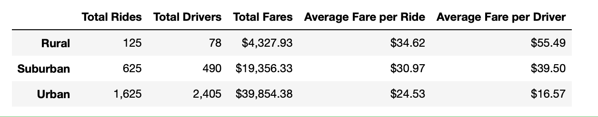

# PyBer Analysis of Ride Sharing Data

## Overview of Analysis
   I have been assigned a new project from the CEO of my new employer PyBer Ride Sharing.  In this assignment, I will create a summary DataFrame of the ride-sharing data by city type.  Additionally, I will create a multiple-line graph that shows the total weekly fares for each city type.  I will use this information to summarize how the data differs by city type and how those differences can be used by the decision-makers at PyBer.  I will use the proper branding information to display my results and will include additional charts, graphs, and documention to be thorough, neat and precise.  

## Results
   My analysis indicates that there is a difference in ride-sharing data among the differnt city types.  Urban locations have a greater number of riders, drivers, and fares.  Additionally, they have a higher average fare per ride and a higher average fare per driver.  The difference is almost 3 to 4 times greater than their suburban and rural conterparts, respectively.  The following chart demonstrates this difference:
   

Further analysis shows that the total fares by city type are consistantly higher over a 3 month period.  Eventhough the are more peaks and valleys during this time period, urban fare rates are consistenly higher than suburban or rural rates.  The following chart shows this pattern:

## Summary

   In summation, it is cheaper and more accesable to share rides and make a profit with the urban centers then it is in the rural areas.  This could be a result of nesessity on the part of the rural areas (each person needs their own mode of transportation to get around and live their lives) and accesablity on the part of the urban centers (ride shares are more readily found and distances shorter and consiquently cheaper). Whatever the case, the main profit is in the urban center.  Therefore, I would recommend the following three things:
   - Continue to increase number of drivers and rides and decrease cost of rides in the urban centers.
   - Focus on accesibility of people visiting the city around long-term parking lots. Perhaps set-up a regular route or drive through.
   - And lastly, utilize a "call-when-needed" campaing for the rural areas to keep costs down but still maintain travel routes to the rural parts of the state.  

